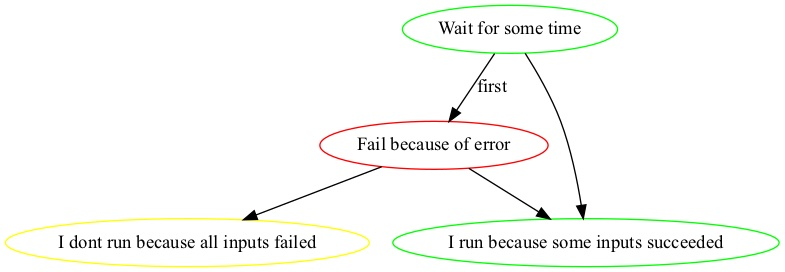

# Graphtask

Graphtask is graph based task runner for complex task orchestration scenarios. It is written in Typescript and available as a commonjs or esm.

## Installation

Use the package manager [npm](https://nodejs.org/en/) to install graph task.

```bash
npm install -g graphtask

// or, as a project dependency
npm install graphtask --save-dev
```


## Usage

Graphtask exposes a global function `task()`, this function is used to build a graph of tasks. The return value of `task()` can then be used as an input to other tasks, to form a graph. The tool uses a pool of web-workers to process tasks as efficiently as possible.

When the graph is run a task will be executed only if at least one of its inputs has succeeded (or if it has no inputs).

### Writing task definitions (flows and actions).

Graphtask requires two files an NAME.flow.js and NAME.actions.js, these files define _what_ is to be done and _how_ it is to be done.

**The flow file**

The flow file describes *what* to do. It defines the tasks and their connections to other tasks.
The following example defines four nodes. The `input` field defines connections between the nodes. The `params` field allows arbitrary data to be passed to each.

```js
const actions = require('./tasks.actions');

const first = task({
  name: 'Wait for some time',   // The title of the task
  action: actions.wait,         // The action to run, must return a promise
  params: { some: 'input' }     // Some arbitrary data to pass in as arguments
});

const error = task({
  name: 'Fail because of error',
  action: actions.errorer,
  input: { 'first': first },    // A labeled input, the result of "first" will be passed in via the argument first
  params: { other: 'data' }
});

task({
  name: 'I dont run because all inputs failed',
  action: actions.wait,
  input: [error]
})

task({
  name: 'I run because some inputs succeeded',
  action: actions.wait,
  input: [error, first],
  params: { some: 'other input' },
})
```

This example produces the following graph:




**The actions file**

The actions file defines *how* to do the tasks. These must be named functions that return a Promise.

```js
const { wait } = require('../utils');

module.exports = {
  wait,

  async errorer() {
    throw new Error('BANNNG');
  }
};

```


## CLI

```bash
graphtask ./tasks_folder      # Run tasks in folder
graphtask ./tasks_folder -p   # Generate a task plan (dont execute task actions)
graphtask ./tasks_folder -o ./results   # Write the output of the run in .json, .log & .dot format to the ./results folder

graphtask --help          # Display command help

```

## Examples

See ./examples sub-folders

e.g.

```
./lib/cjs/cli/index.js ./examples/simple -o /tmp
./lib/cjs/cli/index.js ./examples/complex -o /tmp
```

-- TODO

## Tests

-- TODO

## Contributing
Pull requests are welcome. For major changes, please open an issue first to discuss what you would like to change.

Please make sure to update tests as appropriate.

## License
[MIT](https://choosealicense.com/licenses/mit/)
